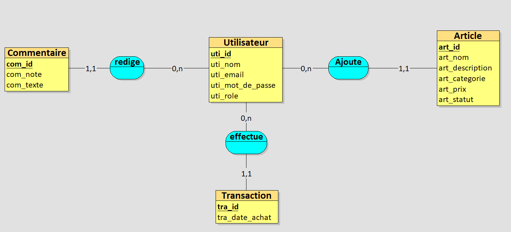
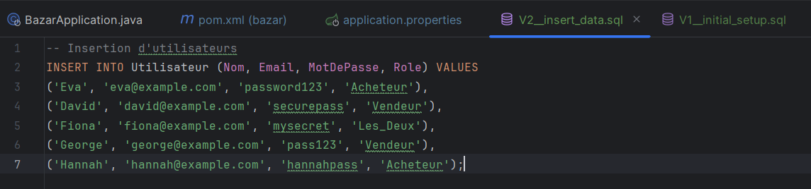
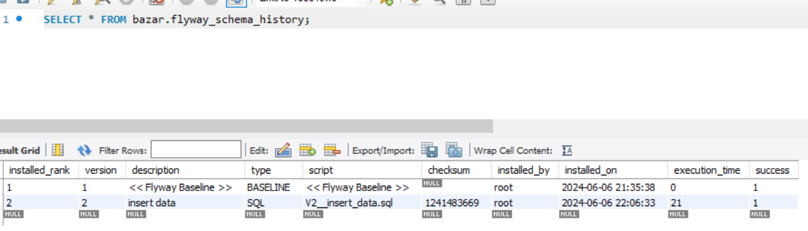
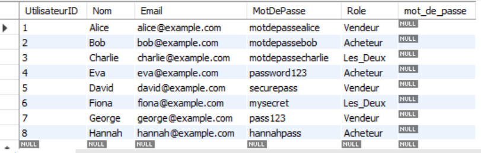
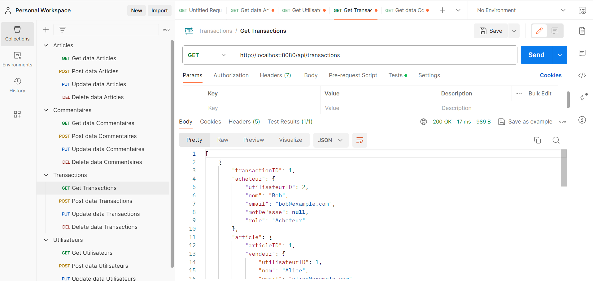
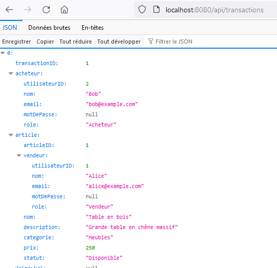

# Bazar-Projet-API-Spring

## Schema Relationnelle 
### MCD

- Un Utilisateur peut être soit **Vendeur** soit **Acheteur**
- Statut (Disponible ou Vendu)
- Categorie (Nourriture, Meubles, Artisanat, Chiens)

## Stack

- Langage : Java
- Framework : Spring Boot
- Base de données : MySQL
- Outils de construction : Maven 
- Migration : Flyway

## Insertion des données avec Flyway 

On check

## Test API avec Postman

## Run Sprint Boot:BazarApplication

